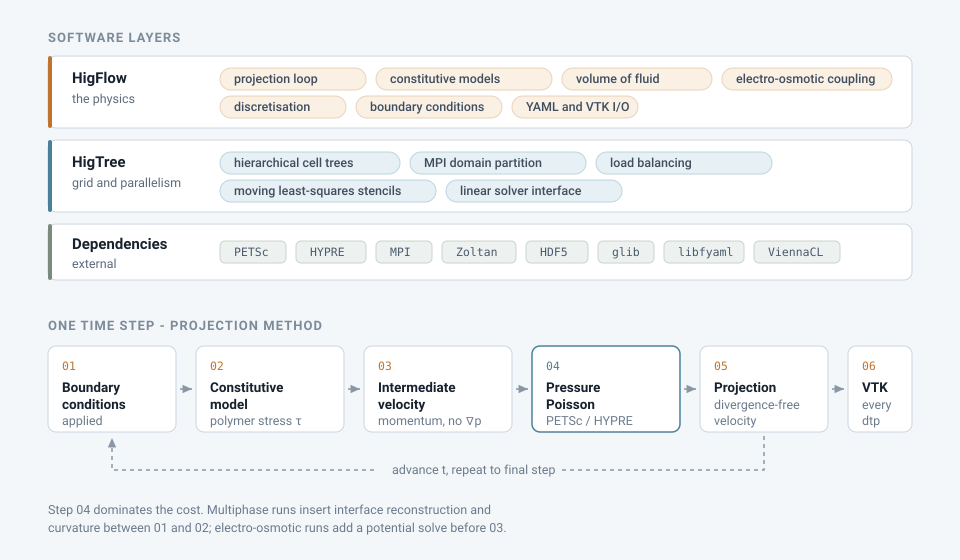
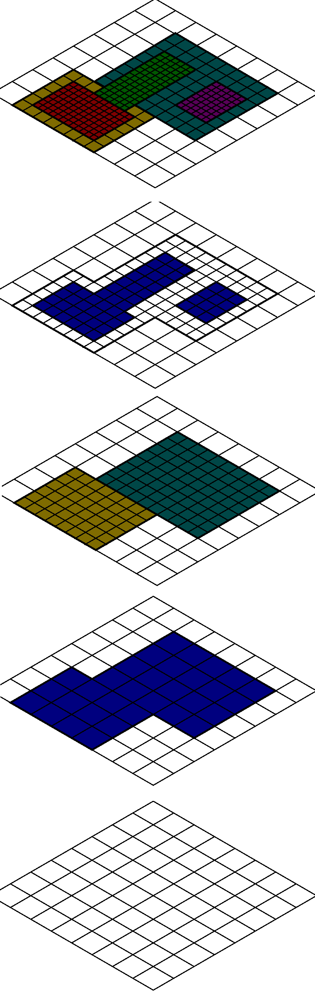
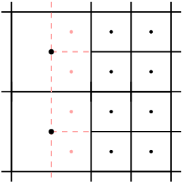
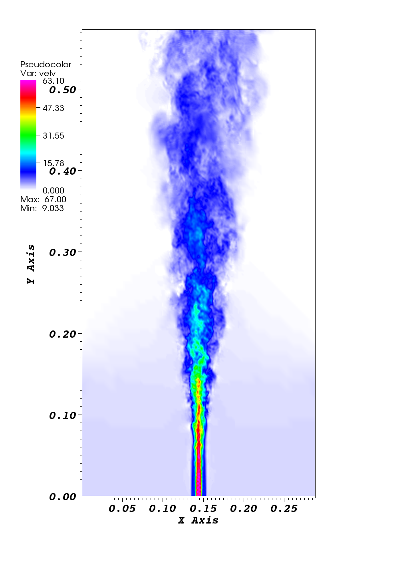

<h1 align="center">HigFlow</h1>

<p align="center">
  <strong>A finite-difference solver for incompressible Newtonian, viscoelastic
  and multiphase flows on hierarchical adaptive grids.</strong>
</p>

<p align="center">
  
  
  
  
</p>

<p align="center">
  <a href="README.pt-BR.md">Leia em português</a>
</p>

---

## What HigFlow is

HigFlow solves the incompressible Navier–Stokes equations by a projection method,
discretised with finite differences on a **staggered, hierarchically refined grid**.
Pressure and scalar properties live at cell centres; velocity components live on cell
faces.

What sets it apart from a general-purpose CFD code is its **rheology**. HigFlow was
built to simulate fluids whose stress does not follow a constant viscosity: polymer
solutions and melts, wormlike micellar solutions, thixotropic and elastoviscoplastic
materials, dense suspensions, and electrolytes driven by electro-osmosis. It carries a
broad library of differential and integral constitutive models, coupled to a
volume-of-fluid method for free surfaces and interfaces.

The code is organised in two layers:

| Layer | Responsibility |
|---|---|
| **HigTree** | The hierarchical adaptive grid: cell trees, domain decomposition across MPI ranks, moving least-squares interpolation between refinement levels, and the interface to linear solvers (PETSc, HYPRE, ViennaCL, SOR) |
| **HigFlow** | The physics: the Navier–Stokes projection loop, constitutive models, volume-of-fluid interface tracking, electro-osmotic coupling, and I/O |

HigFlow is developed at the **Institute of Mathematical and Computer Sciences (ICMC),
University of São Paulo**.

## Problems it is built for

- **Viscoelastic flow** through contractions, expansions and channels — corner
  vortices, stress boundary layers, high Weissenberg number behaviour
- **Free-surface and two-phase flow** — bubbles, droplets, dam break, jet breakup
- **Shear banding** in wormlike micellar solutions
- **Thixotropic and elastoviscoplastic** materials with evolving microstructure
- **Electro-osmotic flow** in microchannels, including electrolyte transport coupled to
  a viscoelastic solvent
- **Dense suspensions** exhibiting shear thickening

## Table of contents

- [Physical models](#physical-models)
- [Numerical methods](#numerical-methods)
- [Architecture](#architecture)
- [Gallery](#gallery)
- [Installation](#installation)
- [Running your first case](#running-your-first-case)
- [Repository layout](#repository-layout)
- [Documentation](#documentation)
- [Citing HigFlow](#citing-higflow)
- [Contributing](#contributing)
- [Authors](#authors)
- [License](#license)

---

## Physical models

Every model below is selected from the case configuration file. No recompilation is
needed to switch between models within the same flow family.

### Flow families

| Family | Configuration key | Description |
|---|---|---|
| Newtonian | `newtonian` | Constant viscosity |
| Generalised Newtonian | `generalized_newtonian` | Shear-rate dependent viscosity |
| Viscoelastic — differential | `viscoelastic` | Evolution equation for the conformation or stress tensor |
| Viscoelastic — integral | `viscoelastic_integral` | Stress as an integral over deformation history |
| Viscoelastic — variable viscosity | `viscoelastic_var_viscosity` | Coupled to a structural parameter |
| Shear banding | `shear_banding` | Two-species network scission |
| Elastoviscoplastic | `elastoviscoplastic` | Yield stress with elastic response below yield |
| Suspensions | `suspensions` | Dense shear-thickening suspensions |
| Multiphase | `multiphase` | Volume-of-fluid interface tracking |

### Differential viscoelastic models

| Model | Key | Parameters | Reference |
|---|---|---|---|
| Oldroyd-B | `oldroyd_b` | `De`, `beta` | Oldroyd (1950) |
| Giesekus | `giesekus` | `De`, `beta`, `alpha` | Giesekus (1982) |
| Linear PTT | `lptt` | `De`, `beta`, `epsilon`, `xi` | Phan-Thien &amp; Tanner (1977) |
| Generalised PTT | `gptt` | `De`, `beta`, `epsilon`, `xi`, `alpha_gptt`, `beta_gptt` | Ferrás et al. (2019) |
| FENE-P | `fene_p` | `De`, `beta`, `L2` | Bird, Dotson &amp; Johnson (1980) |
| e-FENE | `e_fene` | `De`, `beta`, `L2`, `lambda`, `E` | charged dumbbell variant |
| User-defined | `user_set` | — | supplied by the case |

The generalised PTT model evaluates the Mittag-Leffler function
`E_{α,β}`, which reduces to the exponential PTT for `α = β = 1`.

### Integral viscoelastic models

| Model | Key | Damping function |
|---|---|---|
| K-BKZ | `kbkz` | `psm` (Papanastasiou–Scriven–Macosko) or `ucm` |
| Fractional K-BKZ | `kbkz_fractional` | fractional Maxwell model |

K-BKZ after Kaye (1962) and Bernstein, Kearsley &amp; Zapas (1963). The relaxation
spectrum is supplied as arrays of moduli `a` and relaxation times `lambda`.

### Structural, yielding and suspension models

| Group | Available models |
|---|---|
| Thixotropic | `bmp`, `bmp_solvent`, `mbm`, `nm_taup`, `nm_t` |
| Shear banding | `vcm`, `mvcm` — two-species network scission |
| Elastoviscoplastic | `oldroyd_b_bingham`, `oldroyd_b_hb`, `lptt_bingham`, `eptt_bingham`, `general_saramito` |
| Suspensions | `gw`, `gw_wc`, `gw_wc_if`, user-defined |

The BMP family follows Bautista et al. (1999); the VCM model follows Vasquez, McKinley
&amp; Cook (2007); the elastoviscoplastic family follows Saramito (2007, 2009).

### Electro-osmotic models

| Model | Key | Description |
|---|---|---|
| Poisson–Nernst–Planck | `pnp` | Full ion transport |
| Poisson–Boltzmann | `pb` | Equilibrium ion distribution |
| Debye–Hückel | `pbdh` | Linearised Poisson–Boltzmann |
| Debye–Hückel, analytic | `pbdh_analytic` | Closed-form potential |

Electro-osmosis can be combined with the viscoelastic and multiphase solvers.

> **A note on references.** The citations above identify the standard formulation of
> each model. Where a model is listed without a reference, the implementation follows a
> variant for which the authoritative source is best supplied by the original authors —
> contributions completing this table are welcome.

---

## Numerical methods

### Time integration

| Scheme | Key | Type |
|---|---|---|
| Forward Euler | `explicit_euler` | explicit |
| Runge–Kutta 2 | `explicit_rk2` | explicit |
| Runge–Kutta 3 | `explicit_rk3` | explicit |
| Backward Euler | `semi_implicit_euler` | semi-implicit in the diffusive term |
| Crank–Nicolson | `semi_implicit_crank_nicolson` | semi-implicit in the diffusive term |
| BDF2 | `semi_implicit_bdf2` | semi-implicit in the diffusive term |

The semi-implicit schemes treat the viscous term implicitly and the convective term
explicitly, so the time step remains subject to a convective stability limit.

### Convective term

| Scheme | Key | Notes |
|---|---|---|
| Central | `central` | second order, non-monotone |
| First-order upwind | `first_order` | monotone, diffusive |
| Second-order upwind | `second_order` | uses the high-resolution scheme below |

When the second-order stencil crosses a boundary, the discretisation falls back to
first order at that face. This is a deliberate choice for robustness, and it is worth
keeping in mind when measuring convergence order near boundaries.

High-resolution schemes for the second-order path:

| Scheme | Key | Reference |
|---|---|---|
| CUBISTA | `cubista` | Alves, Oliveira &amp; Pinho (2003) |
| QUICK | `quick` | Leonard (1979) |
| Modified coefficient upwind | `modified_coefficient_upwind` | — |

Constitutive equations are advected with either `upwind` or `cubista`, selected
independently of the momentum equation.

### Pressure–velocity coupling

Projection method, in incremental (`incremental`) or non-incremental
(`non_incremental`) form. The pressure Poisson equation is solved through HigTree's
solver interface, which currently wraps:

- **PETSc** — the default; Krylov method and preconditioner are chosen on the command
  line, for example `-ksp_type bcgs -pc_type bjacobi`
- **HYPRE** — algebraic multigrid
- **ViennaCL** — GPU-accelerated iterative solvers, optional at build time
- **SOR** — an OpenMP, NUMA-aware in-tree implementation, optional at build time

### Spatial discretisation

Second order (`second_order`) on the staggered grid. A fourth-order option
(`forth_order`) is accepted by the configuration parser but is **not implemented** in
the discretisation routines; selecting it does not produce a fourth-order scheme.

### Interface tracking

For multiphase flow, the volume-of-fluid method with:

| Component | Methods |
|---|---|
| Interface reconstruction | PLIC — Youngs (1982); ELVIRA — Pilliod &amp; Puckett (2004) |
| Curvature | adaptive height function; finite-difference normal and curvature |

### Grid and parallelism

- Hierarchical cell trees with local refinement, composed into a simulation domain
- Domain decomposition across MPI ranks, with load balancing through Zoltan
- Moving least-squares interpolation for values between refinement levels and at
  partition boundaries
- Dimension is fixed at compile time — the build produces separate 2D and 3D libraries

---

## Architecture

<p align="center">
  
</p>

### The hierarchical grid

HigTree represents the domain as a forest of cell trees. A region needing resolution is
refined locally, so fine cells appear only where the physics demands them — around an
interface, a stress boundary layer, or a re-entrant corner — while the rest of the
domain stays coarse.

<p align="center">
  
</p>

<p align="center"><em>Refinement levels of a HigTree grid, drawn as separate planes.
Coloured regions mark the cells present at each level; the composed grid is their
union.</em></p>

Values are interpolated between levels, and across MPI partition boundaries, with
moving least-squares stencils. Because the grid is staggered, a cell centre and its
surrounding faces carry different quantities:

<p align="center">
  
</p>

<p align="center"><em>Cell-centred values in black; the points in red are where values
must be reconstructed at a refinement boundary.</em></p>

---

## Gallery

<p align="center">
  
</p>

<p align="center"><em>Jet, coloured by velocity magnitude. Figure from the project's
existing documentation.</em></p>

> This section is being expanded with a set of cases that ship with the repository —
> Poiseuille flow validated against its analytical solution, a 4:1 viscoelastic
> contraction, and a multiphase volume-of-fluid case — each with the exact command that
> reproduces it and the visualisation state file used to render it.

---

## Installation

HigFlow targets Linux. It depends on an MPI stack, PETSc and a set of scientific
libraries; the sections below cover a native Linux build and the route for Windows
users.

### Dependencies

| Dependency | Purpose | Ubuntu package |
|---|---|---|
| MPI (OpenMPI) | parallelism | `openmpi-bin`, `libopenmpi-dev` |
| PETSc | linear solvers | built from source |
| HYPRE | algebraic multigrid | `libhypre-dev` |
| Zoltan | load balancing | `libtrilinos-zoltan-dev` |
| HDF5 (parallel) | binary output | `libhdf5-openmpi-dev` |
| glib-2.0 | data structures | `libglib2.0-dev` |
| libfyaml | YAML parsing | built from source |
| Boost | headers | `libboost-all-dev` |
| BLAS / LAPACK | dense linear algebra | via PETSc or system |
| ViennaCL | GPU solvers, optional | — |
| libnuma | NUMA-aware SOR solver, optional | `libnuma-dev` |

### Linux

Install the system packages, then build PETSc and libfyaml. The repository ships
`install_higflow_ubuntu22`, which walks through these steps on Ubuntu 22.04.

> **Before running the bundled installer**, read it. It installs three MPI
> implementations side by side, passes `--with-debubbing=yes` to PETSc's `configure`
> — not a recognised option — and sets `PKG_CONFIG_PATH` to a file rather than a
> directory. A corrected installer is in preparation.

With the dependencies in place, set the environment and build:

```bash
source varsrc
```

`varsrc` exports `HIGTREE_DIR`, `HIGFLOW_DIR`, `PETSC_DIR` and `PETSC_ARCH`. It must be
sourced from the repository root, and **its `PETSC_DIR` must match where PETSc was
actually installed** — the committed value does not match what the bundled installer
produces.

Build the grid library for both dimensions, then the solver library:

```bash
cd higtree && make clean && make DIM=2 && make DIM=3
```

```bash
cd ../higflow && source ../etc/higflow-env-mak.sh && make clean && make DIM=2
```

Alternatively, build with CMake from the repository root. Both `dim` and `debug` must
be supplied — the configuration fails without them:

```bash
cmake -B build -Ddim=2 -Ddebug=0 -Wno-dev && cmake --build build
```

### Windows

There is no native Windows build, and this is a deliberate limitation rather than an
omission: the solver depends on OpenMPI and libfyaml, neither of which has a supported
Windows port, and the CMake configuration requires `libnuma`, which exists only on
Linux.

Use **WSL2**, which gives a real Linux environment on Windows:

```bash
wsl --install -d Ubuntu-22.04
```

Restart when prompted, then follow the Linux instructions inside the Ubuntu shell. Two
practical notes:

- Clone the repository **inside** the WSL filesystem (`~/HigFlow`) rather than under
  `/mnt/c/`. Compilation across the Windows filesystem boundary is substantially slower.
- Your Linux files are reachable from Windows Explorer at `\wsl$\Ubuntu-22.04\home\`,
  so ParaView installed on Windows can open the VTK files directly.
