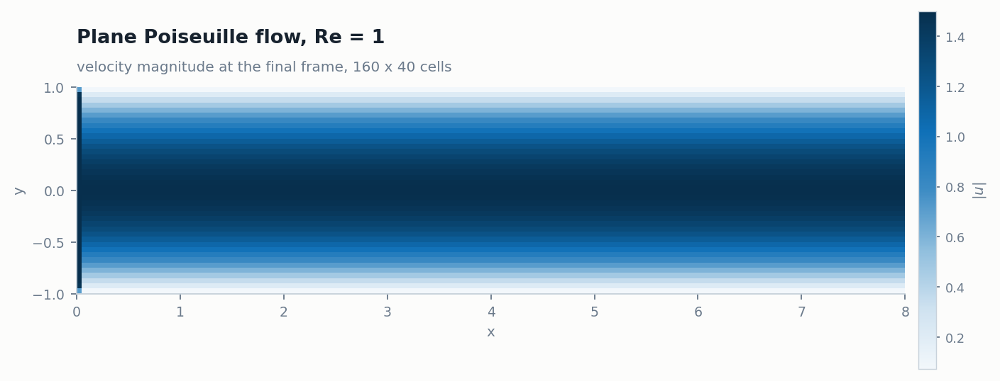
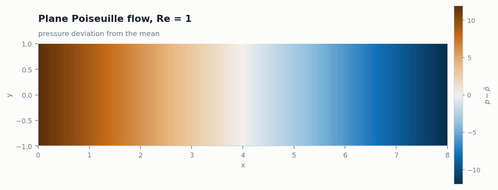
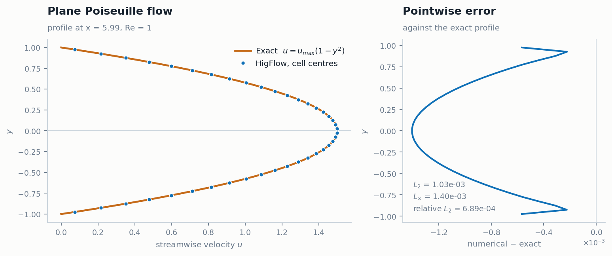
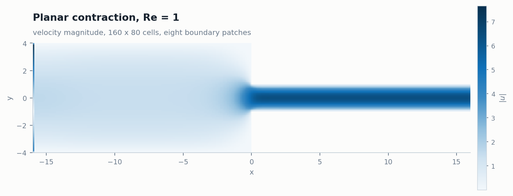
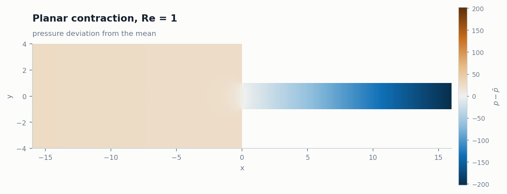
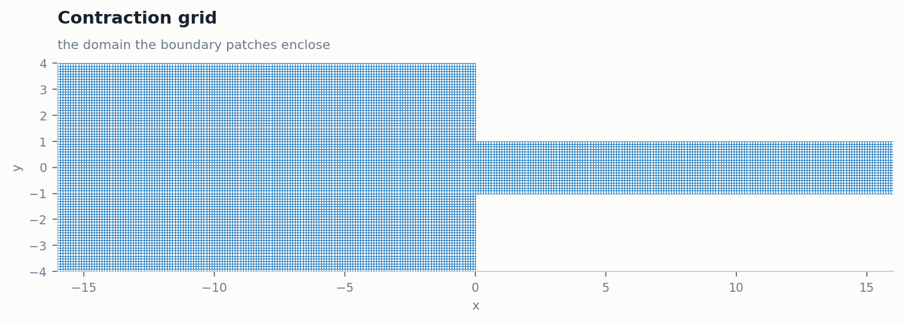
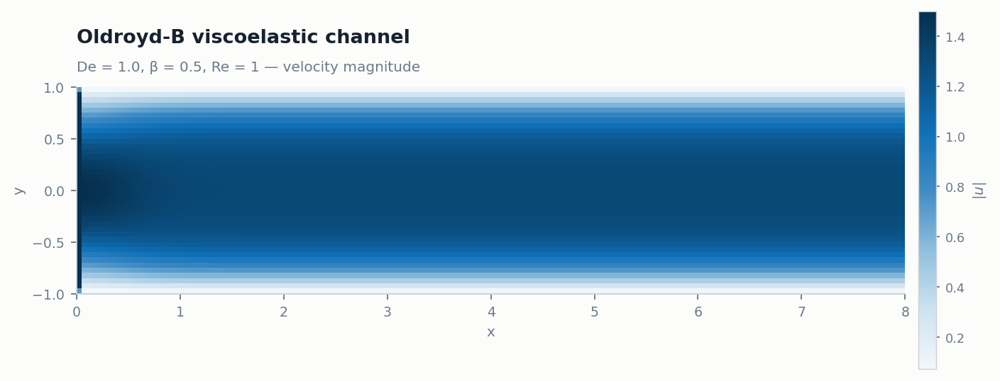
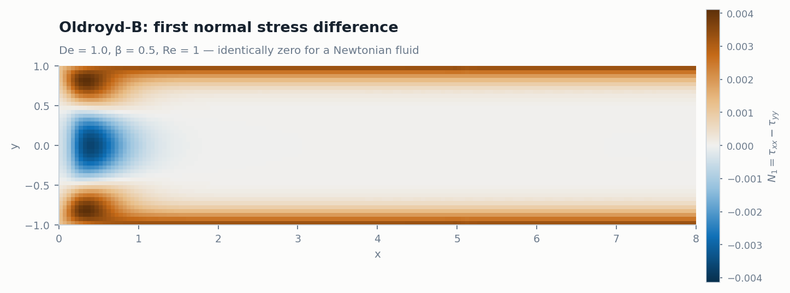

# Gallery

Every figure here was produced by running a case that ships with this
repository, on the container image in [`containers/`](../containers), and
rendering the VTK output with
[`tools/gallery/render.py`](../tools/gallery/render.py). The command that
reproduces each one is given beneath it.

No figure is decoration. Where a case has an exact solution or a conservation
law, the numbers are stated.

---

## Contents

- [Plane Poiseuille flow](#plane-poiseuille-flow)
- [Planar 4:1 contraction](#planar-41-contraction)
- [Oldroyd-B viscoelastic channel](#oldroyd-b-viscoelastic-channel)
- [What is not here yet](#what-is-not-here-yet)
- [Reproducing everything](#reproducing-everything)

---

## Plane Poiseuille flow

`higflow/example2d_Newt` - a channel of length 8 and half-height 1, 160 × 40
cells, Re = 1, parabolic inlet profile.

<p align="center">
  
</p>

The flow is fully developed: the profile is the same at every station. The
pressure field shows why - a constant streamwise gradient is what drives it.

<p align="center">
  
</p>

### It is right, and here is the check

For plane Poiseuille flow the exact solution is known, so the computed profile
can be compared against it rather than merely looked at.

<p align="center">
  
</p>

| | |
|---|---|
| Exact solution | u(y) = u_max (1 − y²), u_max = 1.5 |
| Sampled at | x = 5.99, 40 cells across the channel |
| L₂ error | 1.03 × 10⁻³ |
| L∞ error | 1.40 × 10⁻³ |
| Relative L₂ | **6.89 × 10⁻⁴** |

Two independent checks agree with that.

**The pressure gradient.** Momentum balance for this flow gives
dp/dx = −2μu_max/h² = −3 for μ = 1, u_max = 1.5, h = 1. Over a channel of
length 8 that is a total drop of 24, so the deviation from the mean should span
±12. The colour bar above spans −12 to +12.

**The flow rate.** ∫u dy across the channel should be 2.0 exactly. Measured at
seven stations in the interior:

```
x =  0.175   Q = 1.998711
x =  1.175   Q = 1.998703
x =  2.775   Q = 1.998702
x =  3.825   Q = 1.998702
x =  4.375   Q = 1.998703
x =  5.975   Q = 1.998703
x =  7.775   Q = 1.998702
```

Constant to five parts in 10⁶ across those stations, and 0.065 % below the
exact value, which is consistent with the profile error above.

The word interior is doing work in that sentence. The single cell column
against the inlet is not included, and it does not behave like the rest: it
reports a nearly flat profile close to u_max rather than the parabola, and its
flow rate is wrong by enough that the spread along the channel reads 42.7 %
when it is counted. Whether the solver computes a wrong value there or writes a
wrong one to the file has not been established. The interior, which is
everything from the second column on, holds the conservation law to five parts
in a million.

```bash
docker run --rm -v "$PWD/cases:/work" higflow:latest case example2d_Newt
python3 tools/gallery/render.py --input cases/example2d_Newt/VTKS \
    --out docs/images/gallery --name poiseuille-validation --kind poiseuille
```

---

## Planar 4:1 contraction

`higflow/example2d_Newt_contraction` - upstream channel of half-height 4
narrowing to 1 at x = 0, 160 × 80 cells over two domain blocks and eight
boundary patches, Re = 1.

<p align="center">
  
</p>

<p align="center">
  
</p>

This is the benchmark geometry of computational rheology. Here it runs
Newtonian, which is the reference case the viscoelastic results are read
against - the corner vortex that grows with Deborah number is the phenomenon of
interest, and it needs the viscoelastic solver.

**Mass is conserved through the contraction.** The volumetric flow rate, at four
stations upstream and three downstream:

| Station | Half-height | Q |
|---|---|---|
| x = −15.35 | 4 | 8.5320 |
| x = −11.25 | 4 | 8.5316 |
| x = −4.85 | 4 | 8.5316 |
| x = −0.65 | 4 | 8.5341 |
| x = 1.55 | 1 | 8.5007 |
| x = 7.95 | 1 | 8.5005 |
| x = 15.25 | 1 | 8.5005 |

A discrepancy of 0.37 % across a fourfold area change.

The domain is two blocks, which is what HigTree's composition of cell trees is
for:

<p align="center">
  
</p>

```bash
docker run --rm -v "$PWD/cases:/work" higflow:latest case example2d_Newt_contraction
python3 tools/gallery/render.py --input cases/example2d_Newt_contraction/VTKS \
    --out docs/images/gallery --name contraction-speed --kind speed
```

---

## Oldroyd-B viscoelastic channel

`higflow/example2d_Oldroyd` - the same channel, with the Oldroyd-B constitutive
model. De = 1.0, β = 0.5, Re = 1.

> **This case did not run before this change.** It crashed with a segmentation
> fault on its first time step, because its parameter file said
> `flowtype: newtonian` while its driver called the viscoelastic solver. One
> line fixed it; the story is in [What is not here yet](#what-is-not-here-yet).

Velocity alone looks much like the Newtonian channel, which is the point: the
difference between the two fluids is in the stress, not the kinematics.

<p align="center">
  
</p>

So the figure worth showing is the **first normal stress difference**,
N₁ = τ_xx − τ_yy. It is identically zero for a Newtonian fluid, and non-zero for
a viscoelastic one - it is the quantity the model exists to produce.

<p align="center">
  
</p>

The structure is what Oldroyd-B gives in steady shear: N₁ grows with the square
of the shear rate, so it is largest at the walls and vanishes on the centreline,
where the shear rate is zero. The negative region near the inlet is a startup
transient - this run reaches only t = 0.1.

```bash
docker run --rm -v "$PWD/cases:/work" higflow:latest case example2d_Oldroyd
python3 tools/gallery/render.py --input cases/example2d_Oldroyd/VTKS \
    --out docs/images/gallery --name oldroyd-n1 --kind n1
```

---

## What is not here yet

Assembling this gallery meant running the cases, and two of them do not run.

**All ten shipped cases declare `flowphase: singlephase` and
`flowtype: newtonian`**, whatever their name and whatever their driver calls.
For the cases whose driver calls `higflow_solver_step()` that is consistent. For
the others it is not, and the mismatch is fatal rather than merely wrong:
`flowtype` decides which distributed properties `hig-flow-kernel.c` allocates,
so a driver calling the viscoelastic or multiphase step dereferences arrays that
were never created.

| Case | As shipped | After changing the one line |
|---|---|---|
| `example2d_Oldroyd` | SIGSEGV at step 0 | runs to completion - **fixed here** |
| `example2d_VOF` | SIGSEGV at step 0 | still fails - **not fixed** |

`example2d_VOF` needs more than a configuration change, so it is reported rather
than patched. The remaining cases - `example2d_Gptt`, `example2d_KBKZ`,
`example2d_BMP`, `example2d_VOF_Gptt`, `example2d_VOF_Oldroyd`,
`example3d_complex` - carry the same declaration and were not tested here.

That is why this gallery has no multiphase figure. A volume-of-fluid case is the
most visually striking thing this solver can produce, and it will be added as
soon as the case runs.

## Reproducing everything

The figures depend on nothing but the container, numpy and matplotlib:

```bash
docker build -f containers/Dockerfile -t higflow:latest .
mkdir -p cases

for case in example2d_Newt example2d_Newt_contraction example2d_Oldroyd; do
    docker run --rm --shm-size=1g -v "$PWD/cases:/work" higflow:latest case "$case"
done

python3 tools/gallery/render.py --input cases/example2d_Newt/VTKS \
    --out docs/images/gallery --name poiseuille-speed --kind speed \
    --title "Plane Poiseuille flow, Re = 1" --subtitle "velocity magnitude"
```

`render.py --help` lists the rest. It parses the ASCII VTK files directly and
draws the quadrilateral cells as they are - no interpolation, no resampling, no
VTK library and no display, so it runs unchanged in CI.

### A note on the colour maps

The scalar fields use single-hue sequential ramps, and the signed ones a
diverging ramp with a neutral midpoint. Deliberately not a rainbow: a rainbow
map invents contours where a field is smooth and flattens them where it is not,
so features appear that the solver never produced. The two-colour pair in the
validation plot was checked for colour-vision separation - ΔE 23 under
protanopia - rather than chosen by eye.
